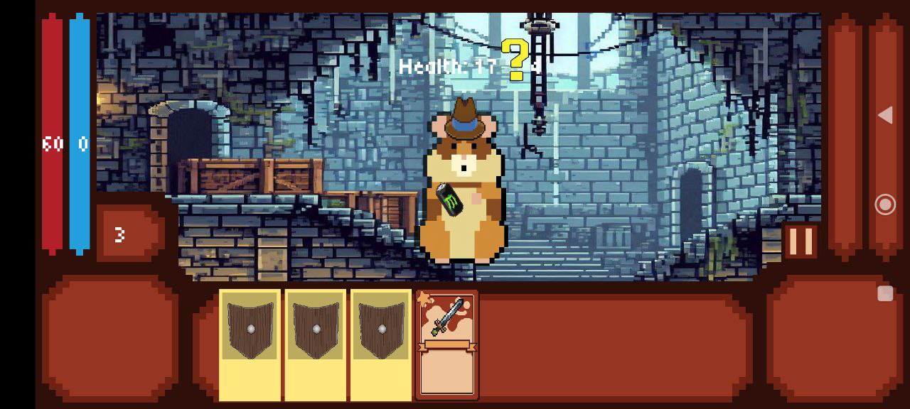
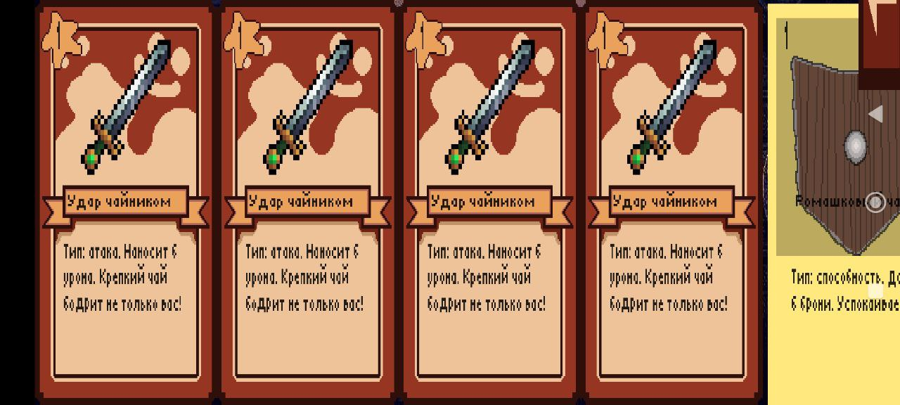
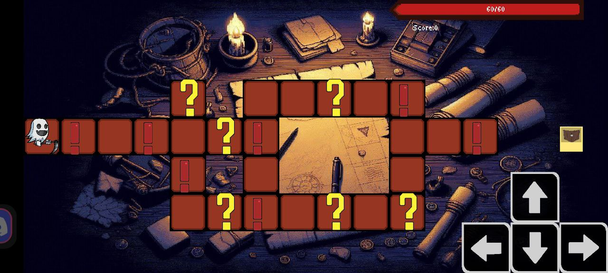
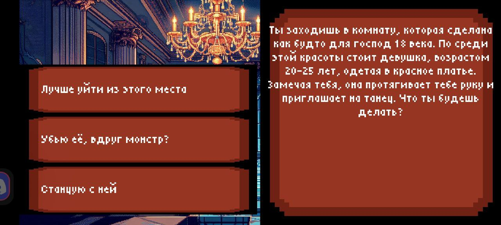

# 🎮 GoidaCards — Карточный Rogue-Lite на Java + LibGDX

[]()
[]()

> **GoidaCards** — это мобильная игра в жанре карточного rogue-lite. Является курсовой работой второго курса по дисциплине *"Технологии и методы программирования"*. Также продвигается в рамках курса **Samsung Innovation Campus: Java-мобильная разработка**.

## 🧩 Основной игровой процесс
Игрок исследует подземелья, сражается с врагами с помощью карт и собирает уникальную колоду. Чем лучше игрок проходит испытания, тем больше очков он получает в конце игры. Вы можете попасть в лидерборд как обладатель самой высокой суммы очков!

📌 **Основные особенности:**
- Динамичные бои на основе карт.
- Процедурно генерируемые подземелья.
- Система сбора и улучшения карт.
- Лидерборд с рекордами игроков.

---

## 👥 Создатели

| Роль                   | Имя                     |
|------------------------|-------------------------|
| Backend-разработчик    | [Клотченко Валерий](https://github.com/sascrystal)     |
| Frontend-разработчик   | [Чаплыгин Виктор](https://github.com/Xpohoc28)       |

### 💖 Особая благодарность
- Алина Лоскутова — художник  
- Алина Мезенцева — художник  
- Богдан Полянский — саунд-дизайнер  

---

## 🛠 Техническая информация

Проект реализован с использованием фреймворка [LibGDX](https://libgdx.com/) — мощного кроссплатформенного инструмента для разработки 2D/3D игр на Java (https://libgdx.com/).

### 📁 Структура проекта:
- `core`: основная логика игры (общая для всех платформ).
- `android`: модуль для Android-приложения.
- `html`: веб-версия игры через GWT/WebGL (https://github.com/libgdx/gdx-liftoff).

### 📦 Инструменты:
- **Gradle** — система управления зависимостями и сборки.
- **gdx-liftoff** — шаблонизатор проекта LibGDX.

#### 🧪 Полезные команды Gradle:
```bash
./gradlew build              # Собрать проект
./gradlew html:dist          # Собрать HTML-версию
./gradlew android:install    # Установить на Android
./gradlew test               # Запустить тесты
```

Дополнительные опции:
- `--continue` — продолжить выполнение при ошибках.
- `--offline` — использовать локальные зависимости.
- `--refresh-dependencies` — перепроверить зависимости.

📖 Подробнее о настройке LibGDX можно узнать из официальной документации или учебных материалов, таких как *"LibGDX Game Development"* (https://www.packtpub.com/product/libgdx-game-development-second-edition/9781785888476) или *"LibGDX Game Development Guide"* (https://book.douban.com/subject/26834311/).

---

## 🖼 Скриншоты

| Скриншот | Описание |
|----------|----------|
|  | *Боевая система* |
|  | *Меню выбора карт* |
|  | *Карта локации* |
|  | *Случайные ивенты* |

---

## 🔧 Как собрать проект?

1. Убедитесь, что установлен **JDK 11+**, **Android SDK** и **Gradle**.
2. Клонируйте репозиторий:
   ```bash
   git clone https://github.com/yourname/GoidaCards.git
   ```
3. Перейдите в папку проекта и соберите его:
   ```bash
   cd GoidaCards
   ./gradlew build
   ```
4. Для запуска Android-версии:
   ```bash
   ./gradlew android:installDebug android:run
   ```

---

## ❤️ Нравится проект? Поддержи нас!

Если вы хотите помочь развитию проекта, улучшить графику или добавить новые механики — добро пожаловать в Pull Requests или Issues!

---

> Разработано студентами 2 курса специальности "Информационная безопасность".
